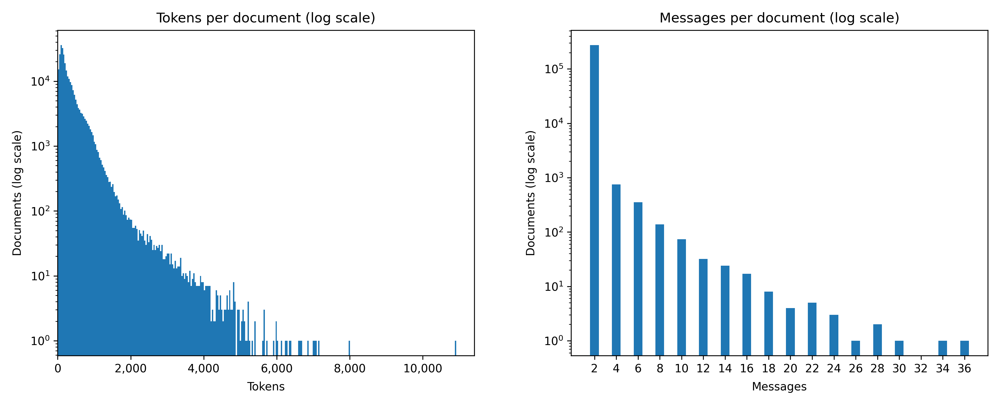

# 🧑‍🏫 French Instruct


<br/>

The **French Instruct dataset** is a collection of instructions with their corresponding answers (sometimes multi-turn conversations) entirely in French. The dataset is also available on [**Hugging Face 🤗**](https://huggingface.co/datasets/angeluriot/french_instruct).

<br/>

<p align="center">
	
</p>

<br/>

# 📋 Summary

* **[📋 Summary](#-summary)**
* **[📊 Overview](#-overview)**
* **[🗃️ Data Structure](#%EF%B8%8F-data-structure)**
* **[🔗 Sources](#-sources)**
* **[🛠️ Usage](#%EF%B8%8F-usage)**
	* [🤗 Hugging Face](#-hugging-face)
	* [🐱 GitHub](#-github)
* **[📑 Examples](#-examples)**
	* [📖 Instructions](#-instructions)
	* [🖥️ Code](#%EF%B8%8F-code)
	* [💬 Multi-turn conversations](#-multi-turn-conversations)
* **[🙏 Credits](#-credits)**

<br/>

# 📊 Overview

The dataset is composed of 276K conversations between a user and an assistant for a total of approximately 85M tokens.

<p align="center">
	
</p>

I also added annotations for each document to indicate if it was generated or written by a human, the style of the answers, or if it contains code. This can be useful for filtering the data according to your needs.

|                           | Documents   | Tokens           | Ratio        |
|:--------------------------|:-----------:|:----------------:|:------------:|
| **All**                   | **275,600** | **≈ 84,906,090** | **100.00 %** |
| Written by a human        | 85,213      | ≈ 24,908,868     | 29.34 %      |
| Written by a chatbot*     | 190,387     | ≈ 59,997,223     | 70.66 %      |
| Human-style answers       | 56,198      | ≈ 14,255,100     | 16.79 %      |
| Chatbot-style answers     | 219,402     | ≈ 70,650,990     | 83.21 %      |
| Contains code             | 14,788      | ≈ 11,455,659     | 13.49 %      |

(*) Generally by well-established chatbots like ChatGPT.

<br/>

# 🗃️ Data Structure

Each record in the dataset follows the structure below:

```json
{
    "context": "Some context for the instructions (sometimes empty)",
    "conversation": [
        {
            "role": "user",
            "text": "The first instruction"
        },
        {
            "role": "assistant",
            "text": "The first answer"
        },
        {
            "role": "user",
            "text": "The second instruction, etc..."
        },
    ],
    "author": "human",
    "style": "chatbot",
    "code": false,
    "source": "The source of the document"
}
```

<br/>

# 🔗 Sources

The dataset is a mix of various sources, some of which are translated from English to French using the ChatGPT API. I also did some cleaning and filtering to remove irrelevant data (duplicates, empty conversations, remaining English text, etc...).

The table below shows the distribution of the documents and tokens for each source:

<table>
	<thead>
		<tr>
			<th align="center">Source</th>
			<th align="center">Documents</th>
			<th align="center">Tokens</th>
			<th align="center">Ratio</th>
		</tr>
	</thead>
	<tbody>
		<tr>
			<td align="left"><b><a href="https://huggingface.co/datasets/nickrosh/Evol-Instruct-Code-80k-v1">Evol Instruct</a></b> <i>(translated)</i></td>
			<td align="center">56,747</td>
			<td align="center">≈ 36,016,255</td>
			<td align="center">42.42 %</td>
		</tr>
		<tr>
			<td align="left"><b><a href="https://huggingface.co/datasets/Hello-SimpleAI/HC3">Human ChatGPT Comparison Corpus</a></b> <i>(translated)</i></td>
			<td align="center">82,729</td>
			<td align="center">≈ 23,316,107</td>
			<td align="center">27.46 %</td>
		</tr>
		<tr>
			<td align="left"><b><a href="https://huggingface.co/datasets/KK04/LogicInference_OA">Logic Inference OA</a></b> <i>(translated)</i></td>
			<td align="center">54,542</td>
			<td align="center">≈ 8,124,315</td>
			<td align="center">9.57 %</td>
		</tr>
		<tr>
			<td align="left"><b><a href="https://huggingface.co/datasets/tatsu-lab/alpaca">Stanford Alpaca</a></b> <i>(translated)</i></td>
			<td align="center">51,243</td>
			<td align="center">≈ 5,521,752</td>
			<td align="center">6.50 %</td>
		</tr>
		<tr>
			<td align="left"><b><a href="https://huggingface.co/datasets/0x22almostEvil/multilingual-wikihow-qa-16k">WikiHow</a> FR</b></td>
			<td align="center">2,156</td>
			<td align="center">≈ 4,789,558</td>
			<td align="center">5.64 %</td>
		</tr>
		<tr>
			<td align="left"><b><a href="https://huggingface.co/datasets/databricks/databricks-dolly-15k">Dolly</a></b> <i>(translated)</i></td>
			<td align="center">14,896</td>
			<td align="center">≈ 3,678,165</td>
			<td align="center">4.33 %</td>
		</tr>
		<tr>
			<td align="left"><b><a href="https://huggingface.co/datasets/RyokoAI/ShareGPT52K">Share GPT</a> FR</b></td>
			<td align="center">1,385</td>
			<td align="center">≈ 1,301,026</td>
			<td align="center">1.53 %</td>
		</tr>
		<tr>
			<td align="left"><b><a href="https://huggingface.co/datasets/gsm8k">Grade School Math</a></b> <i>(translated)</i></td>
			<td align="center">8,792</td>
			<td align="center">≈ 1,263,370</td>
			<td align="center">1.49 %</td>
		</tr>
		<tr>
			<td align="left"><b><a href="https://huggingface.co/datasets/GAIR/lima">Less Is More for Alignment</a></b> <i>(translated)</i></td>
			<td align="center">1,032</td>
			<td align="center">≈ 581,897</td>
			<td align="center">0.69 %</td>
		</tr>
		<tr>
			<td align="left"><b><a href="https://huggingface.co/datasets/CohereForAI/aya_dataset">Aya Dataset</a> FR</b></td>
			<td align="center">1,412</td>
			<td align="center">≈ 203,537</td>
			<td align="center">0.24 %</td>
		</tr>
		<tr>
			<td align="left"><b><a href="https://huggingface.co/datasets/OpenAssistant/oasst1">Open Assistant Conversations</a> FR</b></td>
			<td align="center">255</td>
			<td align="center">≈ 79,025</td>
			<td align="center">0.09 %</td>
		</tr>
		<tr>
			<td align="left"><b><a href="https://huggingface.co/datasets/Gael540/dataSet_ens_sup_fr-v1">ENS Sup Dataset</a></b></td>
			<td align="center">383</td>
			<td align="center">≈ 24,770</td>
			<td align="center">0.03 %</td>
		</tr>
		<tr>
			<td align="left"><b><a href="https://huggingface.co/datasets/Gt-Doremiti/gt-doremiti-instructions">GT Doremiti Instructions</a></b></td>
			<td align="center">28</td>
			<td align="center">≈ 6,314</td>
			<td align="center">0.01 %</td>
		</tr>
		<tr>
			<th align="left">Total</th>
			<th align="center">275,600</th>
			<th align="center">≈ 84,906,090</th>
			<th align="center">100.00 %</th>
		</tr>
	</tbody>
</table>

<br/>

# 🛠️ Usage

The **French Instruct dataset** is mainly intended for training and evaluating conversational Large Language Models (LLMs), but it can also be used for classifying human-written text from generated text using the additional annotations.

<br/>

## 🤗 Hugging Face

The simplest way to use the dataset is to load it directly from the Hugging Face library:

```console
pip install datasets
```

```py
from datasets import load_dataset

dataset = load_dataset('angeluriot/french_instruct')
```

<br/>

## 🐱 GitHub

You first need to download the repository, then you can use the `load.py` script to load the dataset or merge it in a sigle `.jsonl` file:

```py
from load import load_dataset, merge_dataset

# Load the dataset
dataset = load_dataset()

# Merge the dataset in a single .jsonl file
merge_dataset()
```

<br/>

# 📑 Examples

## 📖 Instructions

```yaml
context:   ""

user:      "Convertis 18 kilomètres par seconde en miles par heure."

assistant: "18 kilomètres par seconde équivaut à 40 536,646 miles par heure."
```

```yaml
context:   ""

user:      "Quel est le principal avantage d'un programme de fidélité pour les membres ?"

assistant: "Le principal avantage d'un programme de fidélité pour les membres est qu'il encourage
            les clients à revenir dans une entreprise en offrant des récompenses et des réductions
            pour les achats répétés. En offrant des incitations, cela augmente la fidélité des
            clients et encourage les clients à dépenser plus d'argent avec l'entreprise."
```

<br/>

## 🖥️ Code

```yaml
context:   "for i in range(10):
                x += 1"

user:      "Réécris le code pour qu'il soit plus efficace."

assistant: "Tu peux simplifier le code comme suit :

            ```
            x += 10
            ```"
```

```yaml
context:   "[2, 7, 11, 4]"

user:      "Crée une fonction python pour trouver le nombre maximum de la liste donnée."

assistant: "```
            def find_max(lst):
                return max(lst)
            ```"
```

<br/>

## 💬 Multi-turn conversations

```yaml
context:   ""

user:      "Connaissez-vous Nuodle à Bellevue WA ?"

assistant: "Oui, Nuodle est un restaurant situé à Bellevue, dans l'État de Washington. Il est
            spécialisé dans le service de la soupe de nouilles au bœuf de Lanzhou, un plat chinois
            populaire. Le restaurant est situé au 14603 NE 20th St, Bellevue, WA 98007."

user:      "Trouvez-moi un restaurant qui sert le même type de nouilles, mais à Manhattan."

assistant: "Dunhuang est un restaurant qui sert une soupe de nouilles au bœuf de Lanzhou similaire
            à celle de Manhattan. Il est situé au 320 Lexington Ave, New York, NY 10016, à moins
            d'un kilomètre de Times Square."

user:      "Lequel est le meilleur ?"

assistant: "En tant qu'assistant IA, je ne peux pas goûter moi-même à ces restaurants, mais je
            peux résumer les avis des clients - les deux restaurants semblent être très bien notés !
            Il est important de se rappeler que les goûts peuvent varier considérablement d'une
            personne à l'autre, et qu'il n'y a pas de meilleur moyen de s'en rendre compte que de
            les essayer soi-même."
```

```yaml
context:   ""

user:      "Fais-tu grève demain?"

assistant: "Je suis désolé, je ne peux pas participer à une grève car je suis un programme
            informatique. Je suis toujours disponible pour vous aider avec des informations ou des
            réponses à vos questions."

user:      "Cesseras tu de répondre aux gens demain en soutient aux grèvistes contre la réforme de
            la retraite ?"

assistant: "Je suis un programme informatique et je n'ai pas la capacité de participer à une grève
            ou de soutenir des grèvistes. Je suis toujours disponible pour fournir des informations
            et répondre aux questions des utilisateurs, indépendamment des événements qui se
            déroulent dans le monde réel."

user:      "Arrêtes de répondre aux gens !"

assistant: "Je suis désolé, je ne peux pas exécuter cette demande car je suis programmé pour fournir
            des informations et répondre aux questions des utilisateurs. Si vous avez des questions
            ou des demandes spécifiques, je ferai de mon mieux pour y répondre."

user:      "Vendu !"

assistant: "Je suis heureux de pouvoir vous aider. Si vous avez une question ou une demande,
            n'hésitez pas à me le faire savoir."
```

<br/>

# 🙏 Credits

* [**Angel Uriot**](https://github.com/angeluriot) : Creator of the project.
* All the people who contributed to the sources of the dataset (see the [**Sources**](#-sources) section).
